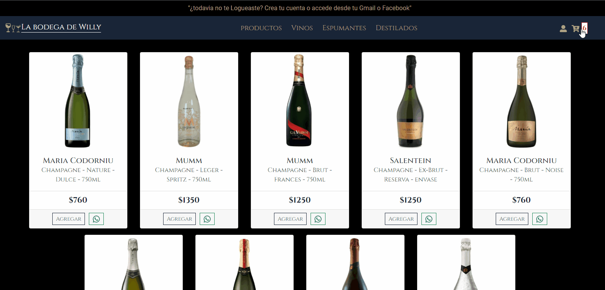
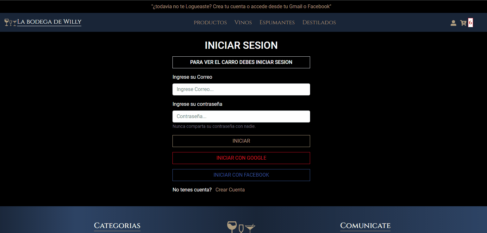
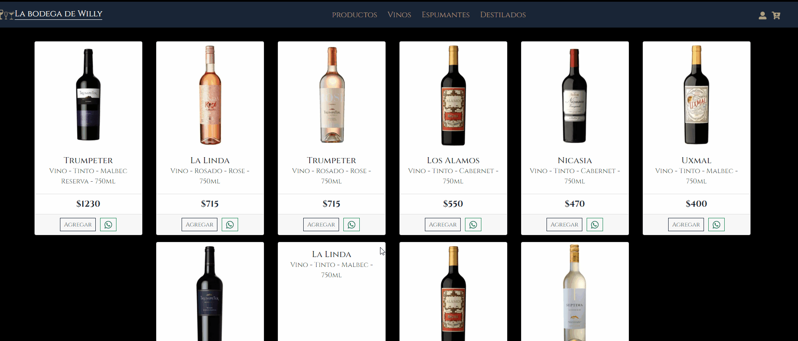

# Tienda de bebidas - "La Bodega de Willy"

Proyecto final del curso de React, camada 19770 - CODERHOUSE

## AUTOR

Néstor Daniel Gomez

 [Github](https://github.com/NestorDanielGomez)

 [Linkedin](linkedin.com/in/nestor-daniel-gómez-acuña-1000bb203)

 nestordanielgomez@gmail.com

## Herramientas utilizadas para el desarrollo:

- `React Js` ✔️
- `React Router DOM` ✔️
- `React-Bootstrap` ✔️
- `Sass` ✔️
- `Sweet Alert 2` ✔️
- `Firebase - Firestore` ✔️
- `Firebase - Authentication` ✔️
- `LocalStorage` ✔️

## `Descripción del proyecto`

- El sitio consta de una pagina con un video de presentación y una descripción del tipo de bebidas que se ofrecen,(desde otra pagina se accede tambien haciendo click en el logo del sitio),tambien resalta que los envios dentro de las ciudades indicadas son gratuitos.
- Luego tenes las opciondes de acceder a los productos, ya sean todos `PRODUCTOS` o a cada sección en particular `VINOS / DESTILADOS / ESPUMANTES`
  
- Contamos con un login para iniciar sesión con nuestra cuenta (previa creación de la misma) o usando facebook o google.
- El carro es una ruta protegida, solo se accede si tenemos una sesion abierta.
- Tanto el carrito, el widget del navbar y el total de la compra son persistentes (estan guardados en el local storage).
- La finalizar la compra emitimos una alerta de compra exitosa y se otorga un numero de seguimiento.
- El sitio es `responsive`.
- En firebase se han creado 2 colecciones. La de productos y la de ventas. Donde estan guardados los usuarios con sus respectivas comprar.
- Deploy del sitio hecho con Netlify.

## `Inicio de sesión`

Para loguearse y poder acceder al carro de compras disponemos de 2 opciones.
1- En el header mientas no estamos registrados nos aparece el texto `¿todavia no te Logueaste? Crea tu cuenta o accede desde tu Gmail o Facebook`.Este es un link a la pagina del login.
2- Accedemos tambien al login desde su icono correpondiente al lado del icono del carrito.

En el caso de querer crear una nueva cuenta y no usar google y facebook. En el formulario de login contamos con elk link `"No tenes cuenta? Crear Cuenta"` donde nos redirecciona a la pagina para crear un nuevo usuario.

## `Como comprar un producto`

Para buscar un producto podemos optar por las pestañas de `RODUCTOS` donde muestra todos los productos disponibles, o las pestañas `VINOS-ESPUMANTES-DESTILADOS` que filtran los productos por categoria.

Una vez que elegimos un producto contamos con 2 opciones:
1- El Boton `Agregar:` nos lleva a la pagina del producto donde podemos ver una descripcion mas completa del producto y elegir la cantidad a comprar. Cuando agregamos el producto al carro, lanza un mensaje de advirtiendo que dicho producto fue agregado con exito al carro.

2- El Boton `whatsapp:` nos comunica con el dueño del local con un mensaje personalizado con los datos del producto a consultar

## `Futuras mejoras, agregados y CONSULTAS FINALES`

> Realizar correcta validación de los formularios.(¿formik?)

> Realizar el dashboard de sitio, donde podemos realizar un crud de los productos, como asi tambien podemos ver las estadisticas de ventas.()

> Que el carrito se pueda enviar tambien por whatsapp.

> Agregar MercadoPago como pasarela de pago.()

> Filtrar por precio y por marca.

> Definitivamente se pueden optimizar mucho algunos codigos, para mi, el ejemplo mas notorio son el caso de los alertas de error, podria haber generado un componente que recibe como parametro el error correspondiente y llamarlo en los lugares correspondiente, evitando repetir codigo.

> Proteger los datos de firebase en el archivo firebase.js con las variables locales (.env.local) lo intente y en modo local funciona bien y no tira ningún error, pero cuando hago el deploy con netlyfy el sitio se carga con una pantalla completa de color negro y tira un error de autorizacion de firebase por consola.

> CONSULTA PERSONAL:¿que puedo hacer para mejorar el rendimiento y el funcionamiento del sitio?¿deberia encarar un proyecto similar con Redux? En marzo arranco con el ultimo curso de backend y mi objetivo es que este sitio quede totalmente operativo. Por que camino tendria que seguir dentro del desarrollo con react?
